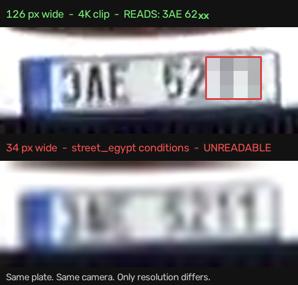

# Plate Capture Plan — OCR and Plate Colour

**Goal:** for every tracked vehicle, capture its licence plate and derive two
things — the **characters** (OCR) and the **plate colour**.

**Headline finding:** these two have very different resolution requirements, and
on the current target footage only one of them is achievable. Plate colour works
today. OCR does not, and the reason is the camera, not the model. That distinction
drives everything below, so it is established first with measurements.

---

## 1. What the footage can support

Three capabilities, three very different floors:

| capability | needs | why |
|---|---|---|
| plate **detection** | ~20 px plate width | a findable bright rectangle |
| plate **colour** | ~20 px | dominant hue of a large flat band |
| plate **OCR** | **~100 px** | individual glyph strokes must be resolved |

Measured on `samples/street_egypt.mp4` (1280x720) — the clip the whole pipeline is
calibrated for — by three independent methods that agree:

| method | result |
|---|---|
| geometric (the pipeline's calibrated road-plane homography x 0.32 m plate) | **34 px** at the closest point in frame |
| empirical (p95 of observed vehicle box widths x plate/vehicle ratio) | **38 px** |
| direct measurement of a hand-located plate in the clip | **34 x 16 px** |

Against a ~100 px floor, that is **~2.7x short**. For contrast, the 4K stock clip
`vehicles_12s.mp4` measures **98 px** and its plates are legible by eye — a plate
reading `NZ 412GC` was read straight off it. That contrast is what validates the
threshold in both directions: the tool passes footage that is genuinely readable
and fails footage that genuinely is not.

Reproduce any of this:

```bash
python -m tools.plate_footage_check                              # all sample clips
python -m tools.plate_footage_check --videos yourclip.mp4        # any new footage
```

**Why this is not a training problem.** OCR must resolve strokes that were never
captured. At a 32 px plate width, H.264 chroma subsampling leaves the whole plate
roughly 16 px of chroma detail; the characters are gone before the file is
written. A model trained on a million plates still cannot read them, because the
information is not in the file. Egyptian plates are harder than average here —
they carry Arabic letters *and* numerals in the same width, and Arabic glyphs are
distinguished by fine strokes and dot placement.

> This is the single most important thing to agree before GPU time is spent. The
> failure mode it prevents: train OCR on a large online dataset, run it on the
> target clip, get nothing, conclude the model needs more data, and spend weeks
> collecting data that cannot help.

### What would make OCR work

Options, cheapest first:

1. **A dedicated ANPR camera** — the standard answer. ANPR cameras cover one or
   two lanes at a shallow angle with a long lens, and are a *separate* device from
   the traffic-overview camera. One camera cannot do both jobs: overview needs a
   wide field of view, OCR needs a narrow one. This is a normal ITS deployment
   pattern, not a workaround.
2. **Higher resolution on the same view** — 4K instead of 720p is a 3x linear
   gain, which lands right at the ~100 px floor. Workable but with no margin, and
   worse at night.
3. **Tighter framing** — same sensor, longer lens, covering less road. Trades
   coverage for plate size; a good option if a chokepoint can be picked.
4. **Multi-frame fusion** (see §5) — a research angle, not a substitute.

---

## 2. Plate colour — the part that works now

Egypt colour-codes the plate's top band by **vehicle category**:

| band colour | category | supports mentor class |
|---|---|---|
| light blue | private car ("malaky") | A |
| red | truck / tractor | C or D |
| orange | taxi | A (commercial use) |
| brown | commercial vehicle | C / V |
| dark blue | police | — |
| green | diplomatic | — |
| yellow | customs unpaid | — |

This is worth more than it first appears. `docs/finetuning-plan.md` identifies
**A vs V** and **C vs D** as the hardest splits — the ones base COCO cannot express
and a monocular size heuristic got wrong. Plate colour is *independent* evidence
for exactly those classes, and it comes from a signal that survives at 34 px where
the OCR signal does not.

It is used as **evidence, not override** (`plates.COLOR_TO_CODES`). A truck towing
a private car still shows its own red plate, and a repainted plate is not a
reclassification.

### The measurement problem, and the fix

The first implementation used absolute HSV thresholds and **rejected a real
plate**. The red band of the box truck in `street_egypt.mp4` measures **S=57**,
far below the S>=70 a clean plate photo gives, because at a 32 px plate width the
codec leaves the 4 px band about 2 px of chroma. Any floor high enough to be safe
rejects it; any floor low enough to accept it starts calling grey bumpers red.

The fix uses a reference the plate carries with it: **the white body below the
band**. Judging the band relative to that neutral patch cancels codec, white
balance and exposure together, because both regions suffered them equally. On the
same truck the band reads S=57 against a body at **S=16** — unambiguous despite the
low absolute value.

Verified with negative controls — the white truck body, its roof, and road asphalt
are all correctly given no colour. Regression tests in `tests/test_pipeline.py`.

> **Open item:** the margin is currently anchored on a handful of hand-located
> plates. It should be re-fitted against EALPR, which has enough labelled Egyptian
> plates to set it from a distribution rather than an example. This is the same
> reservation `classify.HEAVY_MIN_FRONTAL_AREA_M2` carries.

---

## 2b. Measured results on `street_egypt.mp4`

The stage runs today, with a pretrained YOLOv11 plate detector
(`models/plate_detect.pt`, one class, from HuggingFace — no training required for
stage 1):

```bash
python -m pipeline.process_video --input samples/street_egypt.mp4 \
    --output-dir data/jobs/plates_demo --stride 6 --plates
```

| metric | result |
|---|---|
| plates detected | 36 across the clip |
| plate width p90 | **34.6 px** |
| colour mix | 2 red, 1 dark blue, 2 unresolved |
| OCR | correctly declined, with the reason recorded |

The detector's p90 of 34.6 px is a **fourth independent confirmation** of the
34 px figure in §1, and the one that matters most because it comes from a real
trained model rather than an estimate.

**Cross-check.** The pipeline independently classified these five vehicles as one
private car and four trucks. Both resolved red plates sit on vehicles classified
`C`/`D` — the colour signal and the size-based classifier agree without either
being told about the other.

**Known weak spot.** One vehicle classified `A` (private car) resolved as
**dark blue** (police) rather than light blue (private). Light blue and dark blue
differ mainly in *value*, not hue, and value is what a 24 px plate loses first —
this is the exact confusion pair flagged in §4. It is the strongest argument for
re-fitting the thresholds against EALPR rather than trusting hand-set ones.

---

## 2c. The decisive experiment: a real Egyptian ALPR model on this footage

The argument above is geometric. This is the direct test, and it settles it.

**No training was required.** `sshdopey/egyptian-license-plates` on HuggingFace
publishes Egyptian ALPR models that do plate detection *and* Arabic character
recognition in one pass — 30+ classes covering Arabic digits and the letters the
traffic authority issues (`alef`, `baa`, `geem`, `daal`, `Seen`, `Saad`, `Meem`,
`Noon`, `Laam`, `Wow`, `Yeeh`, ...). Downloaded to `models/eg_license_yolo_med_97.pt`.

Run on `street_egypt.mp4`:

| result | value |
|---|---|
| plates detected | 9 (median 30 px) |
| characters emitted | 43 |
| characters **inside** a detected plate | **0** |
| median character box width | 13 px (a real char on a 30 px plate is ~4-6 px) |
| mean character confidence | 0.28, with one class making up 31 of 43 |

**Every character was a false positive.** The model reads nothing here — not
because it is a bad model, but because the glyphs are not in the file.

### The important part

OCR on inadequate footage **does not fail silently**. It emits confident-looking
garbage. A pipeline that simply forwarded this model's output would publish
plate numbers that are pure hallucination, and they would look plausible enough
to be believed and acted on.

This is why `plate_ocr_min_px` gates the **call**, not the result: below the
floor the OCR engine is never invoked, so no invented plate can reach
`analytics.json`. Verified in `tests/test_pipeline.py` — zero invocations across
the real 24-35 px range, normal operation at 160 px.

### The controlled proof



One plate from the 4K clip, at its native 126 px and downscaled to the 34 px this
project's camera delivers. Same plate, same camera, same lighting — resolution is
the only variable. At 126 px it reads `3AE 6211`; at 34 px it is a smear.

Note what survives the downscale: the **blue band is still clearly visible** while
the characters are gone. That is the colour/OCR split in a single image, and it is
why colour is a deliverable here and OCR is not.

---

## 2d. A fine-tune that failed, and why it is not shipped

The plate detector was fine-tuned on EALPR's 2,087 labelled vehicles, rescaled to
the deployment plate size and composited onto 1280x720 frames
(`tools/prep_plate_dataset.py`). It trained cleanly on a T4 and scored
**mAP50 0.985** on the held-out val split.

On the real clip it is a **regression**:

| | usable plates (>=20px AND on a vehicle) | false positives (off-vehicle) |
|---|---|---|
| baseline | **11** | **1** |
| fine-tuned | 3 | **16** |

Raw detection count went *up* (26 -> 39), which is what makes this dangerous: the
headline number improved while the thing it was supposed to deliver got worse.
Median detection width fell from 19.8px to 10.7px, and inspecting the new
detections showed what they were — roadside **guardrail reflectors**, not plates.

**Root cause: the synthetic backgrounds.** Sources were composited onto flat grey
canvases, so the model learned "small bright rectangle on a plain background".
That describes a reflector better than it describes a plate in a road scene. The
plate-size matching was right; the background was not.

**Fix, if this is retried:** paste the rescaled vehicles onto real road frames
sampled from the target footage rather than onto grey, and add
hard-negative crops (reflectors, lights, sign posts) so the model is forced to
tell them apart. Judge it on the usable/false-positive table above, never on
val mAP.

The baseline `models/plate_detect.pt` remains the shipped detector.

---

## 3. Models to train

Two models, trained separately because they answer different questions.

| stage | task | classes | dataset |
|---|---|---|---|
| 1 | plate **detection** on the vehicle | 1 (`plate`) | Roboflow *Egypt Car Plate*; Kaggle license-plate sets; CCPD for volume |
| 2 | **character detection** within the plate crop | 27 | **EALPR** — Egyptian, Arabic, day/night |

Stage 2 is character *detection*, not a text recogniser (CRNN/CTC). This is the
approach the published Egyptian ALPR work uses, and it degrades better: a partly
readable plate returns the characters it is confident about rather than one
confidently wrong string.

```bash
python -m tools.train_plates --stage detect --epochs 80  --device 0
python -m tools.train_plates --stage ocr    --epochs 120 --device 0
```

Two augmentation choices matter more than the rest and are set in
`tools/train_plates.py`:

- **`fliplr=0`** — mirroring a plate reverses reading order and maps some Arabic
  glyphs onto each other. This is the augmentation most likely to quietly ruin the
  OCR model, and it is on by default in YOLO.
- **`mosaic=0` for OCR** — stitching four crops together invents plates that do
  not exist and splits real ones.

### Datasets

Not vendored — large, and separately licensed. Check each licence before use.

- **EALPR** — ~2,000 images / ~10,800 annotated characters, 27 classes, Egyptian,
  varied locations and day/night. The key resource for stage 2.
- **Roboflow Universe — Egypt Car Plate** — plate-level boxes for stage 1.
- **CCPD** — ~290k Chinese plates. Useless for Arabic characters, valuable for
  stage 1 *detection*, which is script-agnostic.
- **Open Images** — has a `Vehicle registration plate` class; diverse, good for
  generalisation.

---

## 4. Acceptance criteria

Judge the two capabilities separately, because one of them is footage-limited.

**Plate detection** (works on current footage)
- recall >= 0.85 on vehicles within the ROI at plate width >= 25 px
- measured on a held-out Elsewedy clip the model never trained on

**Plate colour** (works on current footage)
- accuracy >= 0.85 on hand-labelled bands, and crucially a **low false-colour
  rate**: a wrong colour votes on vehicle class, so "unknown" is much cheaper
  than a confident wrong answer
- report a confusion matrix; watch red<->brown and light blue<->dark blue, which
  differ mainly in value and are the pairs the codec damages most

**Plate OCR** (footage-limited — state the condition with the result)
- on footage meeting the ~100 px floor: character accuracy >= 0.90, full-plate
  exact match >= 0.75
- on `street_egypt.mp4`: **expected to produce nothing**, and the report says why.
  Do not tune against this clip — it cannot be fixed from the model side.

---

## 5. Multi-frame fusion — worth a look, not a plan

The pipeline already has the prerequisite that most ANPR systems lack: **stable
track IDs across occlusions** (`pipeline/reid.py`). A vehicle is observed over
tens of frames at slightly different sub-pixel offsets, and fusing those views can
recover genuine detail — this is standard in forensic plate work.

Realistic expectation: 34 px might fuse toward 60-80 px effective. That reaches
"partial digits, sometimes", not reliable plate reads, and Arabic glyphs need more
resolution than Latin ones to disambiguate. Worth an experiment and a good result
to show; **not** a substitute for adequate footage, and it should not be presented
as one.

---

## 5b. Multi-frame + super-resolution: built, measured, and its ceiling

`pipeline/plate_ocr.py` implements the full enhancement chain:

    every crop of one vehicle
      -> score (sharpness 0.5, size 0.35, detector confidence 0.15)
      -> keep best 3
      -> Real-ESRGAN x4 (RRDBNet, weights loaded with strict=True)
      -> OCR each with the Egyptian ALPR model
      -> confidence-weighted vote (length first, then per position)
      -> one plate + a confidence

Run with `--enhance`; every intermediate image is written under
`<job>/plate_stages/track_XXXX/` (raw crop, super-resolved, OCR overlay).

### Measured on 60 real Egyptian plates

Ground truth is the OCR's own read at native resolution (median ~190 px), so this
measures resolution loss alone rather than model quality. Each plate was degraded
to **34 px** — this project's actual footage — with sub-pixel offsets to simulate
separate frames, then super-resolved and read.

| | character accuracy | exact plate match |
|---|---|---|
| native ~190 px | 100% (by construction) | 60/60 |
| 34 px, 1 crop | **14.9%** | **0/60** |
| 34 px, 3 crops voted | **16.0%** | **0/60** |

Voting is worth about **+1 percentage point**. It is real but tiny, because the
crops fail in *correlated* ways — the same strokes are missing from every frame,
so three views agree on the same wrong answer.

### The super-resolution result is the important one

Real-ESRGAN produces a **sharp, confident, plausible-looking plate** from a 34 px
crop — and the characters it draws are not the ones on the plate. It is trained
to synthesise realistic detail, so on unreadable input it invents readable-looking
output. The saved `_1_sr.png` images show this clearly.

Two consequences worth stating plainly:

* Super-resolution **cannot be used as evidence**. A sharp output image is not a
  read; it is the model doing exactly what it was trained to do.
* The Egyptian ALPR model was **not fooled** — it returned zero characters on
  those hallucinated crops rather than reading the invented glyphs. That is the
  correct behaviour and the reason the pipeline reports nothing instead of
  inventing plate numbers.

### Verdict

The chain is correct, tested, and worth keeping — on footage that meets the ~100
px floor it will work, and the best-crop selection genuinely helps there. On this
camera its ceiling is **0% correct plates**, and no further tuning of selection,
super-resolution or voting moves that, because the limit is information that was
never captured.

---

## 6. Deployment

The stage is already wired to degrade rather than fail: with no weights present,
`PlateReader` reports the reason and the rest of the analytics are unaffected.

```powershell
$env:ITS_PLATE_MODEL="models/plate_detect.pt"
$env:ITS_PLATE_OCR_MODEL="models/plate_ocr.pt"
```

`analytics.json` gains a `plates` block: per-vehicle colour, the classes that
colour supports, measured plate pixel width, and — always — an `ocr_note` stating
why OCR did or did not run. That note is deliberate. An unattributed empty OCR
column reads as a broken model.

---

## 7. Privacy

Plates are **personal data**, and Egypt's Personal Data Protection Law (151/2020)
applies. `.gitignore` already blocks `data/` for this reason.

- Do not commit plate crops or source clips, including to a private repo.
- Do not leave footage in a shared Colab session; clear notebook outputs before
  sharing.
- For analytics that only need counts, speed and class, prefer storing a **hash**
  of the plate rather than the plate itself — it still supports journey-time
  matching across cameras without retaining the identifier.
- Agree a retention period before the first deployment, not after.
